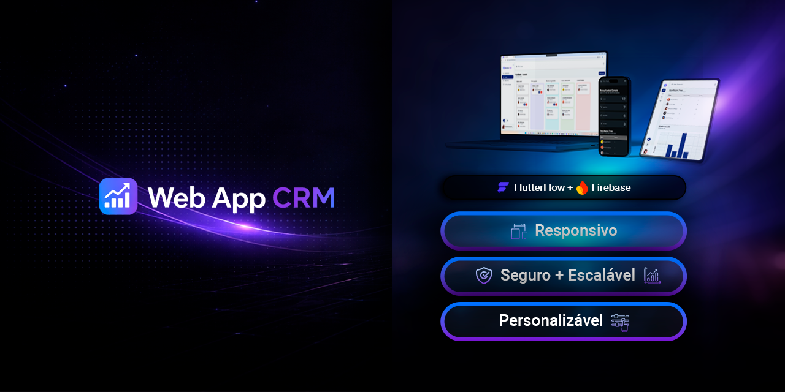
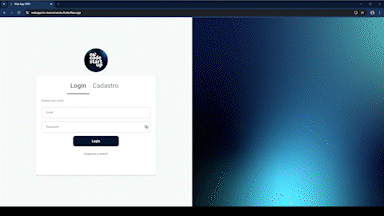

# Web App CRM
### Multi-tenant SaaS CRM | FlutterFlow + Firebase

[](https://webappcrm-leomoraesitu.flutterflow.app)
[](https://github.com/leomoraesitu/web-app-crm/releases/tag/v0.3.0)


---
<p align="center">
  
</p>

---

## 🚀 Aplicação Publicada

🌐 **Produção (Web):**  
👉 https://webappcrm-leomoraesitu.flutterflow.app

📦 **APK Android:**  
👉 https://github.com/leomoraesitu/web-app-crm/releases/tag/v0.3.0

---

## 🎬 Demonstração

<p align="center">
  
</p>

---

## 🏢 Sobre o Produto

SaaS CRM multiempresa para gestão de leads e times comerciais, com arquitetura baseada em Firebase e foco em escalabilidade, isolamento de dados e governança técnica.

---

## 🧠 Diferenciais Técnicos

- Multi-tenant real via `companyId`
- Backend funcional com Firestore
- RBAC (controle de acesso por papel)
- White Label por empresa
- Deploy ativo (Web + APK)
- Ambientes Dev / Prod
- Testes automatizados com cobertura dos fluxos críticos

---

## 🧩 Funcionalidades

### 🔐 Autenticação
- Login / Cadastro
- Sessão persistente
- Feedback via dialogs

### 🏢 Multi-Tenant
- Isolamento de dados por empresa
- Associação usuário → empresa

### 📌 Leads
- CRUD completo
- Kanban integrado
- Status dinâmico

### 👥 Colaboradores
- Criação de usuários
- Permissões (admin/user)

### 📊 Dashboard
- Métricas por empresa
- Contadores agregados

### 🎨 White Label
- Cores e logos customizados por empresa

---

## 🏗 Arquitetura

- FlutterFlow
- Firebase Authentication
- Cloud Firestore
- Firebase Storage

Padrões:
- Multi-tenant
- RBAC
- Desnormalização controlada

📄 Docs:
- `/docs/03_arquitetura.md`
- `/docs/04_modelagem-dados.md`

---

## 📚 Documentação Técnica

Este projeto foi estruturado como um **case completo de engenharia de software**, com documentação organizada por camadas, seguindo padrões utilizados em ambientes corporativos.

### 📂 Estrutura

- `/docs/architecture` → Arquitetura, dados, segurança e environments  
- `/docs/design` → UX, prototipagem e design system  
- `/docs/qa` → Estratégia, execução e métricas de testes  
- `/docs/decisions` → ADRs (decisões arquiteturais)  

---

### 🧠 Cobertura da Documentação

A documentação cobre todo o ciclo do produto:

- Requisitos → UX → Arquitetura → Dados  
- Testes e validação (QA)  
- Estratégia de ambientes (Dev / Staging / Prod)  
- Governança técnica e decisões arquiteturais  

---

### 📌 Destaques

- Modelagem NoSQL documentada (Firestore)
- Estratégia multi-tenant detalhada
- Separação de ambientes e deploy
- QA estruturado com evidências
- ADRs para decisões críticas

---

### 📖 Índice Completo

👉 [`DOCUMENTATION_INDEX.md`](./docs/DOCUMENTATION_INDEX.md)

---

### 🎯 Objetivo

Garantir:

- Rastreabilidade técnica
- Clareza arquitetural
- Facilidade de manutenção
- Escalabilidade do produto

---

## 🧪 Qualidade e Testes

A Sprint 4 introduziu uma **camada formal de QA automatizado**, validando os fluxos críticos de autenticação.

---

### 🔬 Estratégia

- **Widget Tests:** UI e estado  
- **Integration Tests:** fluxos completos  
- **Unit Tests:** regras isoladas  

Arquitetura de testes baseada em desacoplamento (`AuthFacade`) e mocks (`FakeAuthFacade`)

---

### 📌 Escopo Validado

- Login (sucesso / erro)
- Cadastro (sucesso / erro)
- Validação de formulários
- Feedback via dialogs
- Navegação condicional

---

### 📊 Resultados

- Total de testes: **7**
- Aprovados: **7**
- Falhas: **0**
- Taxa de sucesso: **100%**

✔ Execução determinística  
✔ Suíte estável  
✔ Baixa fragilidade

---

### 🧪 Cobertura

| Área | Status |
|------|--------|
| Autenticação | ✅ Completa |
| Validação de formulário | ⚠️ Parcial |
| Navegação | ✅ |
| Backend (Firestore real) | ❌ |
| Dashboard | ❌ |
| Leads | ❌ |

---

### 🐞 Bugs Identificados

Durante a Sprint 4:

- Falha de navegação pós-auth → corrigida
- Fluxo de onboarding incompleto → corrigido

✔ Nenhum bug na execução final

---

### 🧪 Evidência

Execução realizada em:

- Data: 2026-03-26
- Ambiente: Local (Flutter)
- Execução: CLI

✔ **Status final: 100% GREEN**

---

### 📁 Estrutura

```
test/
integration_test/
docs/qa/
```


---

### ⚠️ Limitações

- Firebase real não testado
- Sem cobertura de Dashboard / Leads
- Execução ainda não integrada ao CI

---

### 🚀 Próximos Passos (QA)

- Firebase Emulator
- Testes de multi-tenant
- Cobertura de Leads e Dashboard
- CI/CD (GitHub Actions)

---

## 🌐 Environments

O projeto adota uma estratégia de ambientes para garantir isolamento, segurança e governança no ciclo de entrega.

| Ambiente | Finalidade | Firebase Project | Deploy |
|----------|------------|------------------|--------|
| Dev | Desenvolvimento local | `web-app-crm-dev` | `http://localhost` |
| Staging | Homologação / validação pré-produção | `web-app-crm-dev` | `https://webappcrm-staging.flutterflow.app` |
| Prod | Produção | `web-app-crm-prod` | `https://webappcrm-leomoraesitu.flutterflow.app` |

### Princípios adotados
- Isolamento entre ambientes
- Storage separado por projeto
- Variáveis de ambiente por contexto
- Feature flags para controle de funcionalidades
- Fluxo controlado de promoção Dev → Prod

### Observabilidade e comportamento por ambiente
- **Dev:** logs habilitados, crash reporting desabilitado
- **Prod:** logs desabilitados, crash reporting e performance monitoring habilitados

📄 Documentação completa: `/docs/07_environments.md`

---

## 📊 Gestão de Projeto

A condução do projeto segue uma abordagem de **Kanban adaptado para projeto solo**, com foco em rastreabilidade, previsibilidade e evolução incremental.

### Metodologia
- Kanban
- Gestão visual via Trello
- Versionamento e histórico técnico via GitHub
- Evolução orientada por sprint goals

### Roadmap macro
- **v1:** Design e Estrutura
- **v2:** Dados e Segurança
- **v3:** Publicação

### Ferramentas de gestão
- Trello
- GitHub

Essa estrutura suporta a evolução do produto desde prototipagem até backend, ambientes e publicação.

📄 Documentação completa: `/docs/06_gestao-projeto.md`

---

## 📈 Roadmap

| Fase | Status |
|------|--------|
| Sprint 1 – Planejamento | ✅ |
| Sprint 2 – Prototipagem | ✅ |
| Sprint 3 – UI | ✅ |
| Sprint 4 – Backend + QA | ✅ |
| Sprint 5 – Segurança | 🔜 |
| Sprint 6 – Escala | 🔜 |

---

## 📦 Distribuição

- 🌐 Web (produção)
- 📱 APK Android
- 🏷 GitHub Releases

---

## 📌 Status Atual

🟢 Produto funcional  
🟢 Backend integrado  
🟢 Testes automatizados (100% green)  
🟡 Segurança avançada em evolução  

---

## 📄 Histórico

👉 [CHANGELOG.md](./CHANGELOG.md)  
👉 [Release v0.3.0](https://github.com/leomoraesitu/web-app-crm/releases/tag/v0.3.0)

---

## 👨‍💻 Autor

### Léo Moraes

Projeto desenvolvido com foco em arquitetura SaaS, engenharia de software e boas práticas de mercado.
