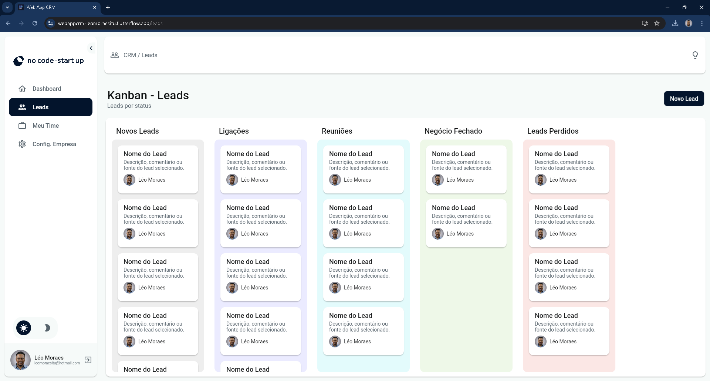
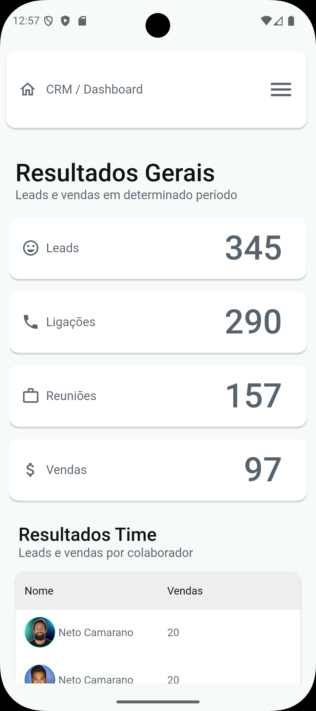

# Web App CRM
### Multi-tenant SaaS CRM | FlutterFlow + Firebase

---

## 🚀 Aplicação Publicada

🌐 **Versão Web (Produção)**  
👉 https://webappcrm-leomoraesitu.flutterflow.app

📦 **APK Android disponível na Release v0.2.0**  
👉 https://github.com/leomoraesitu/web-app-crm/releases/tag/v0.2.0

Este projeto possui deploy público ativo e distribuição Android via GitHub Releases.

---

## 🖥 Preview da Aplicação

### Dashboard (Desktop)

### Kanban

### Mobile View

---

## 🧪 Ambiente

A versão publicada atualmente corresponde à **v0.2.0 (Sprint 3 – UI Consolidada)**.

- Camada de interface finalizada
- Estrutura responsiva validada
- Base pronta para integração Firestore (Sprint 4)

---

## 🏢 Sobre o Produto

Web App CRM é uma aplicação SaaS multiempresa desenvolvida para estruturar e escalar processos comerciais de pequenas e médias equipes.

O sistema oferece:

- Dashboard estratégico
- Gestão visual de leads
- Estrutura Kanban
- Controle de acesso por perfil (RBAC)
- Isolamento completo de dados por empresa (multi-tenant)

Arquitetado com foco em escalabilidade, segurança e governança técnica.

---

## 🎯 Proposta de Valor

Resolve três problemas críticos:

- Falta de padronização do funil
- Baixa visibilidade de métricas
- Risco de acesso indevido entre empresas

O modelo multi-tenant baseado em `companyId` garante isolamento total de dados.

---

## 🧩 Funcionalidades Implementadas (v0.2.0)

### 🔐 Autenticação
- Login
- Cadastro
- Estrutura preparada para controle de sessão

### 📊 Dashboard
- Layout responsivo
- Gráficos estruturados
- Tabelas organizadas

### 📌 Kanban
- Estrutura visual pronta
- Organização por status
- Base preparada para integração Firestore

### 👥 Gestão de Interface
- Menu colapsável
- Desktop / Tablet / Mobile
- Dark & Light Mode
- Componentização avançada
- Animações aplicadas

---

## 🏗 Arquitetura Técnica

Arquitetura SaaS baseada em:

- FlutterFlow (Frontend Web + Mobile)
- Firebase Authentication
- Cloud Firestore (NoSQL)
- RBAC (Role-Based Access Control)
- Multi-tenant via `companyId`

📄 Detalhes completos em `/docs/03_arquitetura.md`

---

## 📈 Roadmap do Produto

| Fase | Status |
|------|--------|
| Sprint 1 – Planejamento | ✅ |
| Sprint 2 – Prototipagem | ✅ |
| Sprint 3 – UI Executável (v0.2.0) | ✅ |
| Sprint 4 – Integração Firestore | 🔜 |
| Sprint 5 – Regras de Segurança Produção | 🔜 |
| Sprint 6 – Deploy Final Estável (v1.0.0) | 🔜 |

---

## 📊 Gestão de Produto

- Metodologia: Kanban
- Story Points definidos
- Definition of Done aplicada
- Versionamento SemVer
- Conventional Commits
- ADRs documentados
- Releases versionadas no GitHub

Board oficial:
https://trello.com/invite/b/698b8510a32a13b502ffda3d/ATTIc658d790b2083b685dcbd9f0532def2c3CC9D074/web-app-crm-flutterflow-firebase

---

## 🏛 Governança Técnica

- Isolamento multi-tenant
- Controle de acesso por papel
- Separação clara entre UI e dados
- Versionamento estruturado
- Documentação centralizada em `/docs`
- Histórico evolutivo rastreável via Releases

---

## 📂 Documentação Técnica

A documentação completa está estruturada em `/docs`, incluindo:

- Visão Estratégica
- Requisitos
- Processo de Prototipagem
- Arquitetura
- Modelagem de Dados
- Segurança
- ADRs
- Gestão do Projeto
- QA

---

## 📦 Distribuição

- 🌐 Web Deploy ativo
- 📱 APK Android disponível na Release v0.2.0
- 🏷 Versionamento oficial via GitHub Releases

---

## 📌 Status Atual

🟢 Produto publicado (Web + APK)  
🟡 UI consolidada (v0.2.0)  
🔜 Integração completa com backend (Sprint 4)  
🔐 Preparação para regras de segurança produção  

---

## 📄 Histórico de Versões

Consulte o histórico completo em:

👉 [CHANGELOG.md](./CHANGELOG.md)  
👉 [Release v0.2.0](https://github.com/leomoraesitu/web-app-crm/releases/tag/v0.2.0)
