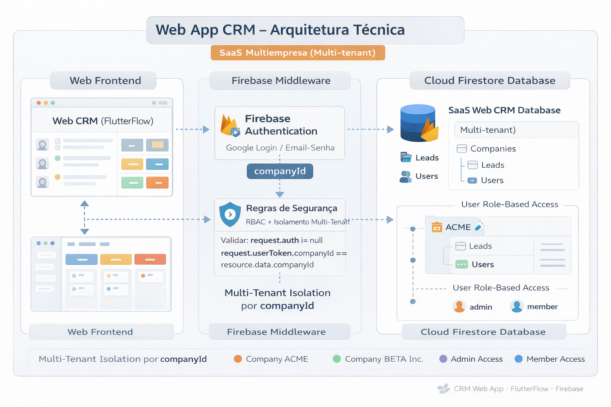

# Arquitetura do Sistema

## Visão Geral
Arquitetura baseada em frontend FlutterFlow consumindo serviços Firebase.

FlutterFlow → Firebase Auth → Firestore → Storage

## Multi-Tenant
Todos os dados possuem `companyId` para garantir isolamento.

## Padrões
- App State para sessão
- Componentes reutilizáveis
- Convenção de nomes consistente

## Diagrama de Arquitetura Geral

FlutterFlow (Frontend Web)
        ↓
Firebase Authentication
        ↓
Cloud Firestore (NoSQL)
        ↓
Regras de Segurança (RBAC + companyId)
