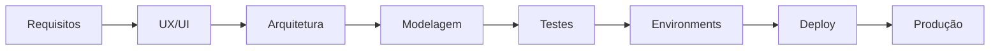

# 📚 Documentation Index — Web App CRM

Este documento centraliza e organiza toda a documentação técnica do  
projeto **Web App CRM (FlutterFlow + Firebase)**.

**Objetivo:** garantir rastreabilidade, governança técnica e clareza arquitetural.

---

# 🗂 Estrutura da Documentação

## 1️⃣ Arquitetura e Engenharia

📍 Localização: `/docs/architecture/`

| Documento | Descrição |
|----------|----------|
| [00_visao-geral.md](./architecture/00_visao-geral.md) | Contexto do projeto, objetivos e proposta de valor |
| [01_requisitos.md](./architecture/01_requisitos.md) | Requisitos funcionais e não funcionais |
| [02_ux-ui.md](./architecture/02_ux-ui.md) | Estratégia de UX/UI e experiência do usuário |
| [03_arquitetura.md](./architecture/03_arquitetura.md) | Visão arquitetural, decisões e padrões |
| [04_modelagem-dados.md](./architecture/04_modelagem-dados.md) | Modelo conceitual, lógico e físico (Firestore) |
| [05_seguranca-privacidade.md](./architecture/05_seguranca-privacidade.md) | Segurança, RBAC e isolamento multi-tenant |
| [06_gestao-projeto.md](./architecture/06_gestao-projeto.md) | Metodologia, roadmap e organização |
| [ENVIRONMENTS.md](./architecture/ENVIRONMENTS.md) | Estratégia de ambientes (Dev, Staging, Prod) |
| [DIAGRAMA_ARQUITETURAL.md](./architecture/DIAGRAMA_ARQUITETURAL.md) | Diagrama arquitetural detalhado |

---

## 2️⃣ Design e Experiência

📍 Localização: `/docs/design/`

| Documento | Descrição |
|----------|----------|
| [README.md](./design/README.md) | Visão geral do design |
| [PROTOTIPAGEM.md](./design/PROTOTIPAGEM.md) | Wireframes e validação |
| [USER_FLOW.md](./design/USER_FLOW.md) | Fluxos de navegação |
| [RESPONSIVIDADE.md](./design/RESPONSIVIDADE.md) | Estratégia multi-dispositivo |
| [DESIGN_SYSTEM.md](./design/DESIGN_SYSTEM.md) | Tokens e componentes |
| [RASTREABILIDADE_REQUISITOS.md](./design/RASTREABILIDADE_REQUISITOS.md) | Matriz de rastreabilidade |

---

### 🎨 Assets de Design

📍 `/docs/design/assets/`

- `prototipagem/low-fidelity/`
- `prototipagem/high-fidelity/`
- `brand/`
- `diagrams/`

---

## 3️⃣ QA & Testes

📍 Localização: `/docs/qa/`

| Documento | Descrição |
|----------|----------|
| 00_qa_sprint4.md | Relatório de QA |
| 01_test-strategy.md | Estratégia de testes |
| 02_test-execution-sequence.md | Execução dos testes |
| 03_test-cases.md | Casos de teste |
| 04_test-coverage.md | Cobertura |
| 05_qa-metrics.md | Métricas |
| evidence.md | Evidências |

---

## 4️⃣ Decisões Arquiteturais (ADRs)

📍 Localização: `/docs/decisions/`

| Documento | Descrição |
|----------|----------|
| ADR-0001-multi-tenant.md | Estratégia multi-tenant via `companyId` |

---

## 5️⃣ Documentos Globais

| Documento | Localização |
|----------|------------|
| README.md | Raiz |
| CHANGELOG.md | Raiz |

---

# 🏛 Padrões de Documentação

- Semantic Versioning (SemVer)  
- Conventional Commits  
- Rastreabilidade ponta a ponta  
- Arquitetura multi-tenant  
- Environment-driven architecture  
- Separação por camadas (Architecture / Design / QA / Decisions)

---

# 🔄 Fluxo Arquitetural

---

# 📌 Fluxo de Leitura Recomendado
1. 00_visao-geral
2. 01_requisitos
3. 02_ux-ui
4. 03_arquitetura
5. 04_modelagem-dados
6. 05_seguranca-privacidade
7. ENVIRONMENTS
8. QA
9. DESIGN_SYSTEM
10. ADRs
11. CHANGELOG

---

# 🚀 Objetivo do Projeto

Este repositório representa um **case completo de engenharia de software aplicada a um SaaS CRM**, demonstrando:

* Arquitetura escalável
* Multi-tenant real
* Governança técnica
* Estratégia de ambientes
* QA estruturado
* Pipeline Dev → Prod
* UX completo
* Documentação padrão corporativo
