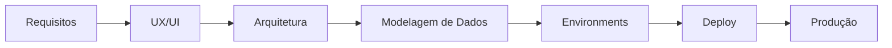

# 📚 Documentation Index — Web App CRM

Este documento centraliza e organiza toda a documentação técnica do  
projeto **Web App CRM (FlutterFlow + Firebase)**.

**Objetivo:** garantir rastreabilidade, governança técnica e clareza arquitetural.

---

# 🗂 Estrutura da Documentação

## 1️⃣ Arquitetura e Engenharia

📍 Localização: `/docs/architecture/`

| Documento | Descrição |
|----------|----------|
| [00_visao-geral.md](./architecture/00_visao-geral.md) | Contexto do projeto, objetivos e proposta de valor |
| [01_requisitos.md](./architecture/01_requisitos.md) | Requisitos funcionais e não funcionais |
| [02_ux-ui.md](./architecture/02_ux-ui.md) | Estratégia de UX/UI e experiência do usuário |
| [03_arquitetura.md](./architecture/03_arquitetura.md) | Visão arquitetural, decisões e padrões |
| [04_modelagem-dados.md](./architecture/04_modelagem-dados.md) | Modelo conceitual, lógico e físico (Firestore) |
| [05_seguranca-privacidade.md](./architecture/05_seguranca-privacidade.md) | Segurança, RBAC e isolamento multi-tenant |
| [06_gestao-projeto.md](./architecture/06_gestao-projeto.md) | Metodologia ágil, roadmap e organização |
| [07_environments.md](./architecture/ENVIRONMENTS.md) | Estratégia de ambientes (Dev, Staging, Prod) e deploy |
| [DIAGRAMA_ARQUITETURAL.md](./architecture/DIAGRAMA_ARQUITETURAL.md) | Diagrama arquitetural detalhado |

---

## 2️⃣ Design e Experiência

📍 Localização: `/docs/design/`

| Documento | Descrição |
|----------|----------|
| [README.md](./design/README.md) | Visão geral da documentação de design |
| [PROTOTIPAGEM.md](./design/PROTOTIPAGEM.md) | Wireframes e validação de fluxos |
| [USER_FLOW.md](./design/USER_FLOW.md) | Fluxos de navegação e autorização |
| [RESPONSIVIDADE.md](./design/RESPONSIVIDADE.md) | Estratégia multi-dispositivo |
| [DESIGN_SYSTEM.md](./design/DESIGN_SYSTEM.md) | Tokens, componentes e padronização visual |
| [RASTREABILIDADE_REQUISITOS.md](./design/RASTREABILIDADE_REQUISITOS.md) | Matriz de rastreabilidade |

---

### 🎨 Assets de Design

📍 Localização: `/docs/design/assets/`

- `prototipagem/low-fidelity/` → Wireframes (WF-*)  
- `prototipagem/high-fidelity/` → Design final (HF-*)  
- `brand/` → Identidade visual (BRAND-*)  
- `diagrams/` → Diagramas visuais  

---

## 3️⃣ DevOps & Ambientes

📍 Localização: `/docs/architecture/`

| Documento | Descrição |
|----------|----------|
| [ENVIRONMENTS.md](./architecture/ENVIRONMENTS.md) | Configuração de ambientes, variáveis e estratégia de deploy |

💡 *Observação:* neste projeto, DevOps é tratado dentro da camada de arquitetura (escopo MVP).

---

## 4️⃣ Decisões Arquiteturais (ADRs)

📍 Localização: `/docs/decisions/`

| Documento | Descrição |
|----------|----------|
| ADR-0001-multi-tenant.md | Isolamento multiempresa via `companyId` |

Cada ADR documenta:

- Contexto  
- Decisão tomada  
- Alternativas avaliadas  
- Consequências técnicas  

---

## 5️⃣ Documentos Globais

| Documento | Localização |
|----------|------------|
| CHANGELOG.md | Raiz do projeto |
| README.md | Raiz do projeto |

---

# 🏛 Padrões de Documentação

- Semantic Versioning (SemVer)  
- Conventional Commits  
- Rastreabilidade: requisito → implementação → release  
- Arquitetura multi-tenant (`companyId`)  
- Separação de responsabilidades (Architecture / Design / Decisions)  
- Environment-driven architecture  

---

# 🔄 Fluxo Arquitetural do Projeto

---

### 📌 Fluxo Recomendado de Leitura
1. 00_visao-geral
2. 01_requisitos
3. 02_ux-ui
4. 03_arquitetura
5. 04_modelagem-dados
6. 05_seguranca-privacidade
7. 07_environments
8. PROTOTIPAGEM
9. DESIGN_SYSTEM
10. ADRs
11. CHANGELOG

---

### 🚀 Objetivo do Projeto

Este repositório foi estruturado como um **case completo de engenharia de software aplicada a um CRM SaaS**, demonstrando:

- Arquitetura escalável e orientada a ambientes
- Segurança e isolamento multi-tenant
- Governança técnica e rastreabilidade
- Processo ágil estruturado
- Pipeline de entrega (Dev → Staging → Prod)
- UX completo (Wireframe → High Fidelity)
- Documentação no padrão corporativo