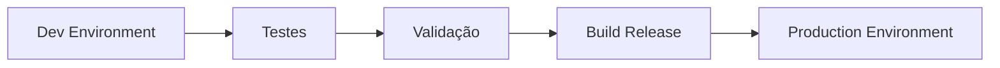

# 🌐 Environments — Web App CRM

Este documento define a estratégia de ambientes (**Development, Staging e Production**) do projeto **Web App CRM (FlutterFlow + Firebase)**, garantindo isolamento, segurança, rastreabilidade e governança.

---

## 🎯 Objetivo
Separar claramente os contextos de execução do sistema para:
- Isolar contextos de execução  
- Garantir qualidade antes do deploy  
- Evitar impacto em usuários reais  
- Suportar pipeline de entrega contínua  

---

## 🏗 Arquitetura de Ambientes

| Ambiente   | Finalidade                          | Firebase Project        | Base URL / Deploy |
|------------|------------------------------------|--------------------------|-------------------|
| Dev        | Desenvolvimento local              | web-app-crm-dev         | http://localhost |
| Staging    | Homologação / validação pré-prod   | web-app-crm-dev         | https://webappcrm-staging.flutterflow.app |
| Prod       | Produção (usuários reais)          | web-app-crm-prod        | https://webappcrm-leomoraesitu.flutterflow.app |

---

## 🌍 URLs de Deploy

### Staging
https://webappcrm-staging.flutterflow.app

### Production
https://webappcrm-leomoraesitu.flutterflow.app

---

## ⚙️ Configuração no FlutterFlow

```
App Settings → Dev Environments
```

---

## 🔑 Variáveis de Ambiente

### Production

```yaml
appEnv: production
appName: WebAppCRM
appVersion: 0.3.0
appBuild: 2026.03.07

firebaseProjectId: web-app-crm-prod
firebaseRegion: southamerica-east1
firebaseStorageBucket: gs://web-app-crm-prod.firebasestorage.app

appBaseUrl: https://webappcrm.app

storageUsersPath: users
storageUploadsPath: uploads
storageLeadsPath: leads

featureAnalytics: true
featureAIAssistant: false

enableDebugLogs: false
enableCrashReporting: true
enablePerformanceMonitoring: true

featureDevBanner: false
```

---

### Development

```yaml
appEnv: dev
appName: WebAppCRM
appVersion: 0.3.0
appBuild: 2026.03.07-dev

firebaseProjectId: web-app-crm-dev
firebaseRegion: southamerica-east1
firebaseStorageBucket: gs://web-app-crm-dev.firebasestorage.app

appBaseUrl: http://localhost

storageUsersPath: users
storageUploadsPath: uploads
storageLeadsPath: leads

featureAnalytics: true
featureAIAssistant: true

enableDebugLogs: true
enableCrashReporting: false
enablePerformanceMonitoring: false

featureDevBanner: true
```
---

## 🔥 Configuração no Firebase

Cada ambiente possui um projeto isolado:

- Dev: https://console.firebase.google.com/u/0/project/web-app-crm-dev/overview
- Prod: https://console.firebase.google.com/u/0/project/web-app-crm-prod/overview?hl=pt-br

### Estrutura:
| Item	|  Dev	| Prod |
| -----	|  ----	| ---- |
| Projeto Firebase | web-app-crm-dev | web-app-crm-prod
| Apps registrados | Android / iOS / Web | Android / iOS / Web
|Storage	|Isolado	|Isolado
|Firestore	|Isolado	|Isolado

### 📦 Arquivos de Configuração

**Android**

`android/app/google-services.json`

**iOS**

`ios/Runner/GoogleService-Info.plist`

⚠️ Cada ambiente deve usar seu próprio arquivo.

---

## 🔄 Estratégia de Deploy


---

### 🚀 Processo de promoção Dev → Prod

1. Validar funcionalidades no ambiente Dev
2. Garantir integridade de dados e regras de segurança
3. Atualizar variáveis no FlutterFlow (Production ativo)
4. Gerar build de produção
5. Publicar (Web / Stores)

---

### 🔐 Segurança e Boas Práticas

**Isolamento de dados**
- Nunca compartilhar Firestore entre ambientes
- Storage separado por projeto

**Configuração segura**
- Não versionar arquivos sensíveis (google-services.json)
- Usar variáveis de ambiente para endpoints

**Logs e Monitoramento**
|Feature	|Dev	|Prod|
|---|---|---|
|Debug Logs	|✅	|❌
|Crash Reporting	|❌	|✅
|Performance Monitoring	|❌	|✅

### 🧠 Feature Flags

Permitem controle dinâmico de funcionalidades:

|Feature|Dev|Prod|
|-------|---|----|
|AI Assistant|✅	|❌|
|Dev Banner	|✅	|❌|
|Analytics	|✅	|✅|
---
### 🧩 Integração com Arquitetura do Projeto

A estratégia de ambientes suporta diretamente:

- Arquitetura multi-tenant (empresas isoladas)
- Governança de dados e segurança
- Evolução incremental do produto (No-Code Start-Up)
---
### ⚠️ Riscos e Cuidados
- ❌ Usar Firebase Dev em produção
- ❌ Misturar dados reais com dados de teste
- ❌ Deploy sem validação no Dev
- ❌ Reutilizar Storage entre ambientes

---

## ✅ Checklist de Deploy

[x] Variáveis de ambiente revisadas\
[x] Firebase correto selecionado\
[x] Storage validado\
[x] Regras de segurança aplicadas\
[x] Build gerado em modo release\
[x] Logs desativados (Prod)\
[x] Monitoramento ativo

---

### 📌 Padrão adotado no projeto
```
Environment-driven architecture
            +
Firebase project isolation
            +
Feature flags
            +
Controlled deployment flow 
```

### 🧠 Conclusão

A implementação de ambientes no projeto segue práticas modernas de engenharia:

- Separação clara de responsabilidades
- Segurança por isolamento
- Escalabilidade do produto
- Pronto para CI/CD