# 📦 Web Deployment – Sprint 3
Data: 2026-03-02  
Versão: v0.2.0 (Sprint 3)  
Ambiente: FlutterFlow Web (Production)

---

## 🌐 URL Publicada

https://webappcrm-leomoraesitu.flutterflow.app

---

## 🧪 Smoke Test UI

| Teste | Status | Observações |
|--------|--------|-------------|
| Desktop renderização | OK ||
| Tablet responsivo | OK ||
| Mobile responsivo | OK ||
| Menu Desktop | OK ||
| Menu Mobile (hamburger) | OK ||
| Dark / Light Mode | OK ||
| Dashboard (gráficos) | OK ||
| Kanban (scroll/overflow) | OK ||

---

## 📸 Evidências Visuais

### 🌐 Web - Desktop
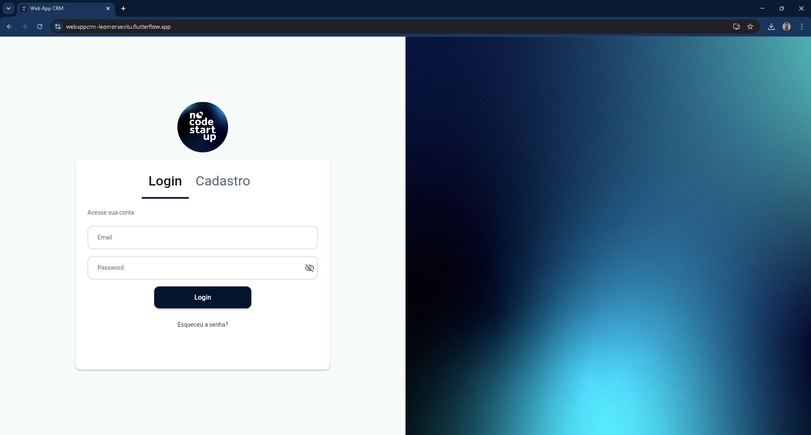
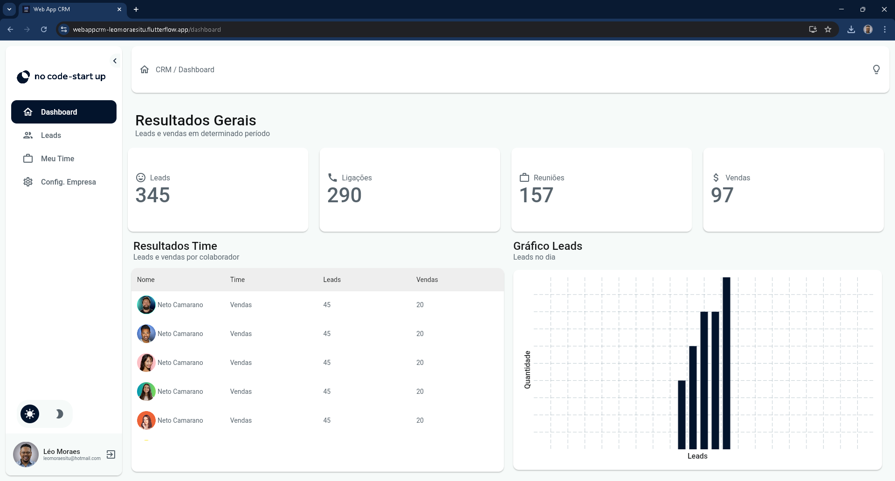

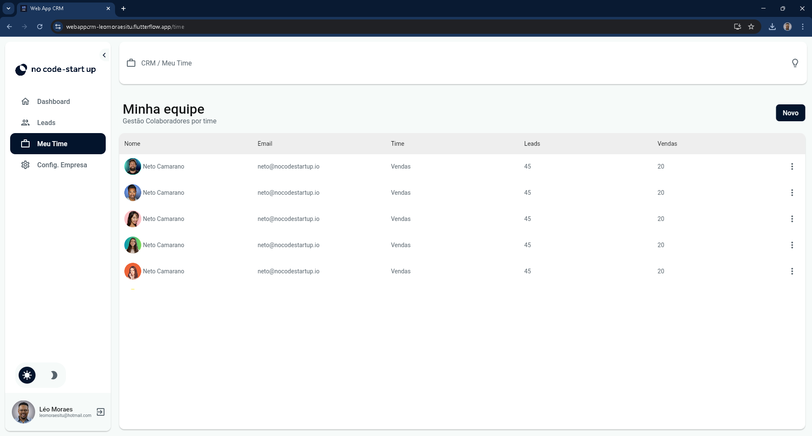

### 📱 Tablet
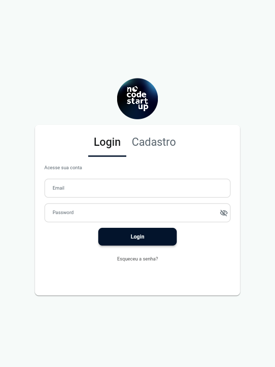
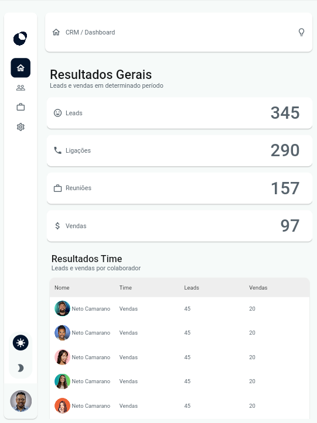
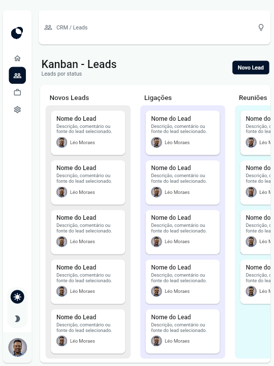
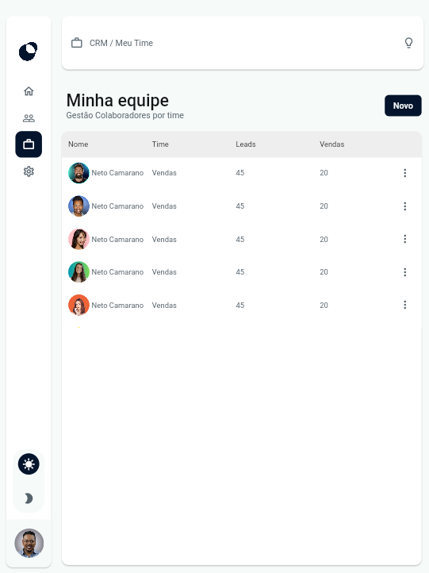

### 📱 Mobile
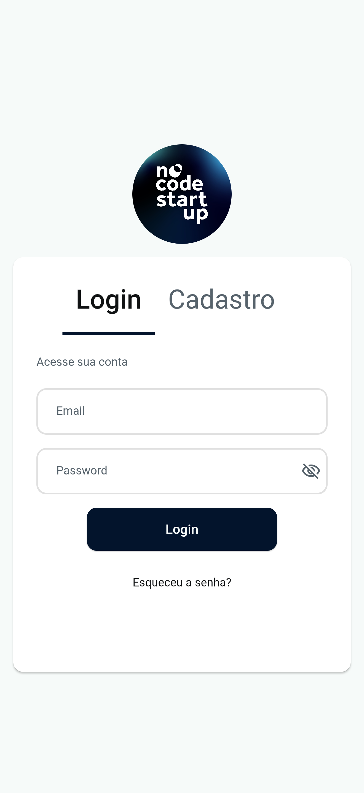
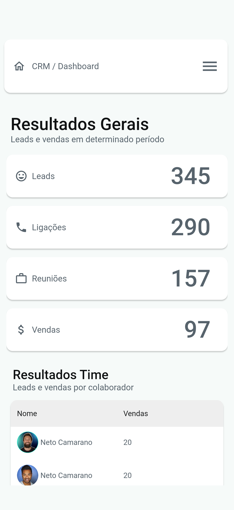
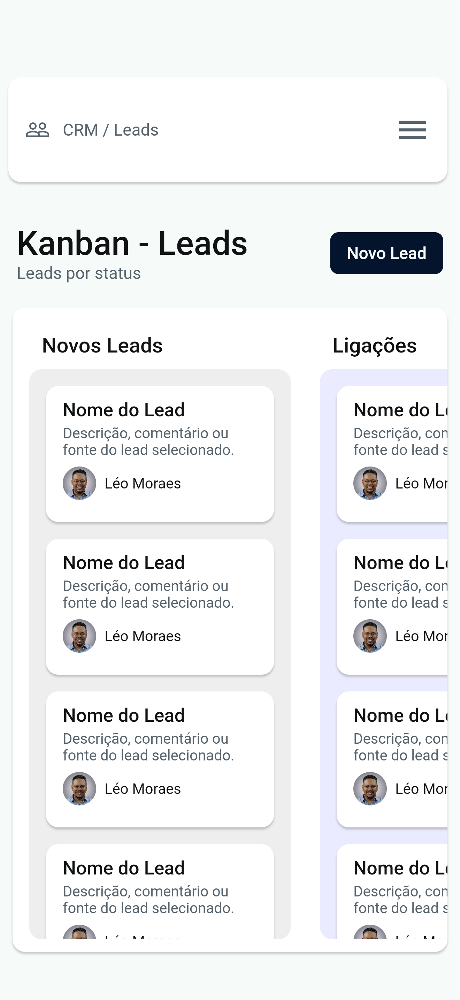
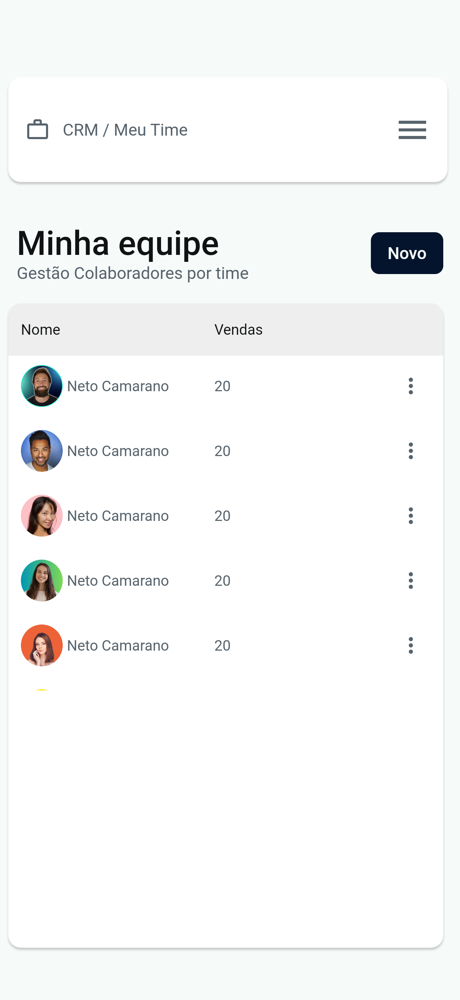

---

## ⚠ Limitações Conhecidas

- Firebase ainda não configurado
- Autenticação não integrada
- Dados ainda mockados
- Sem regras de segurança implementadas

---

## 📌 Conclusão

Deploy validado visualmente.
Base pronta para integração backend na Sprint 4.